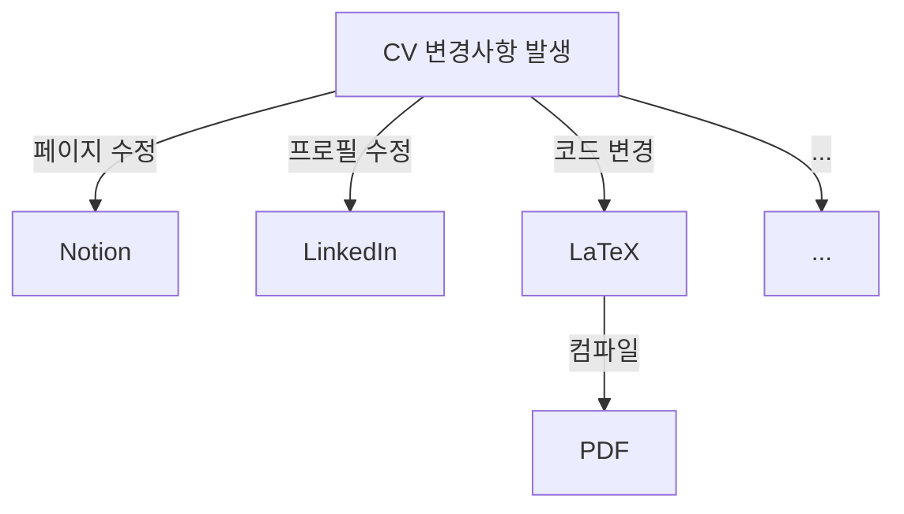
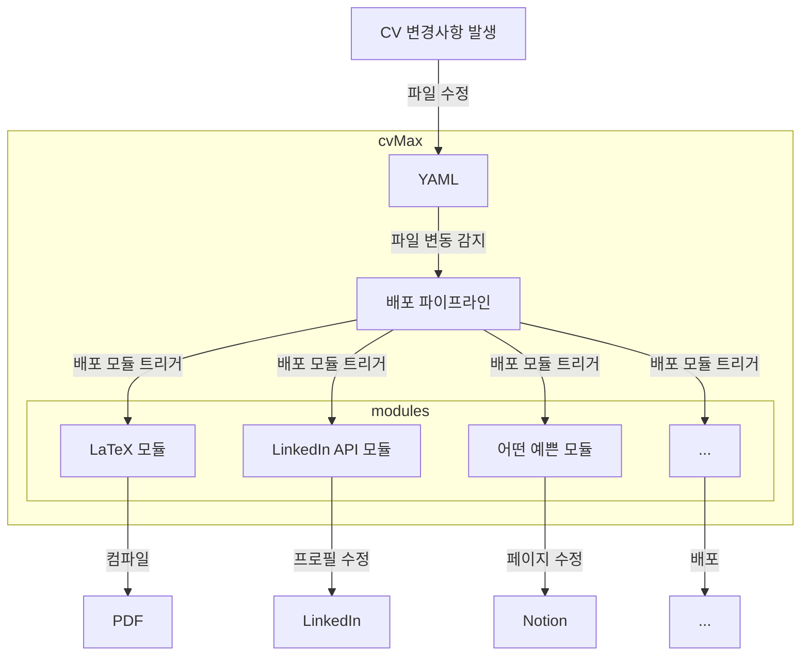
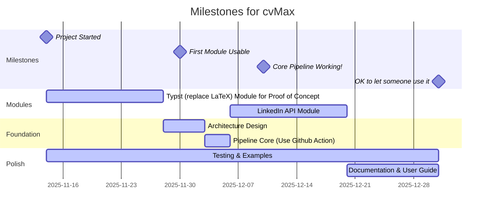

# cvMax
## Objective
cvMax lets you
* manage your CV in a single file, and
* automatically deploy it to whatever format you need without any extra work.

So instead of managing your CV like this:

I'm changing it to this to make everyone's life easier:

# Milestones
Here's my plan to make this happen:
> I work on this whenever I feel like it, so I've set pretty conservative estimates.

# Ideas
While developing this, I came up with some features that would be cool to have. Maybe I'll add them to the milestones later.
* Import from existing sources (Github, LinkedIn, Notion, etc.) into YAML for fast initialization
* Use deployment modules made by others (think VSCode Extension)
* Since managing YAML means creating a Single Source of Truth (SSoT) for career history, maybe it could be used as a foundation to have AI write cover letters and other documents?
* A lot of people aren't comfortable editing YAML, so providing a GUI might be nice
* What if I offer YAML storage as a paid service?