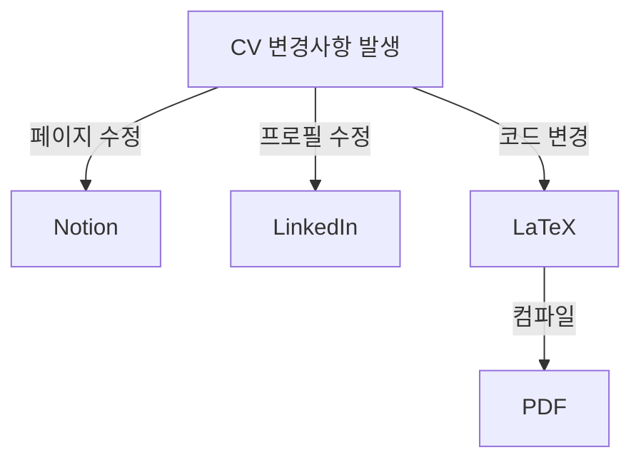
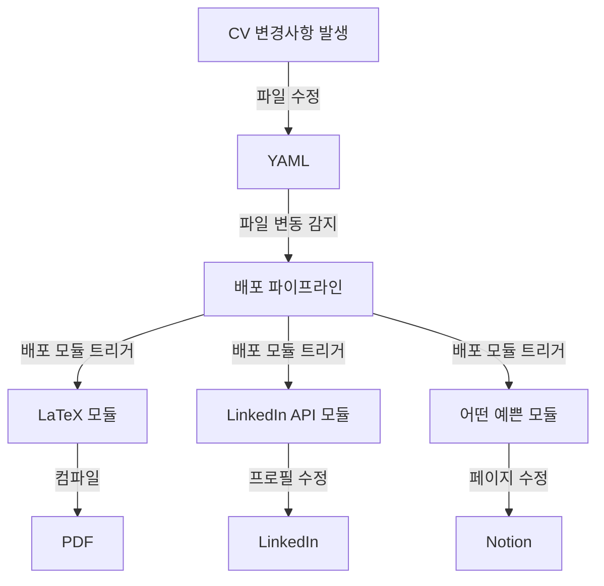

# cvMax
## 개요
cvMax 프로젝트는 사용자들로 하여금
* CV는 하나의 파일에서만 관리하고
* 추가적인 노동 없이 필요한 포맷으로 자동으로 배포할 수 있게 하는 것

을 목표로 합니다.

즉, 아래와 같은 CV 관리 구조를,

```mermaid
flowchart TD
    CV[CV 변경사항 발생]
    CV -- 페이지 수정 --> Notion[Notion]
    CV -- 프로필 수정 --> LinkedIn[LinkedIn]
    CV -- 코드 변경 --> LaTeX[LaTeX] --컴파일--> PDF[PDF]
```

아래와 같이 변경해서 작성자를 덜 귀찮게 만드는 것을 목표로 하고있습니다.

```mermaid
flowchart TD
    CV[CV 변경사항 발생]
    CV -- 파일 수정 --> YAML[YAML]
    YAML -- 파일 변동 감지 --> Pipeline[배포 파이프라인]
    Pipeline -- 배포 모듈 트리거 --> LaTeX[LaTeX 모듈] -- 컴파일 --> PDF[PDF]
    Pipeline -- 배포 모듈 트리거 --> LinkedInAPI[LinkedIn API 모듈] -- 프로필 수정 --> LinkedIn[LinkedIn]
    Pipeline -- 배포 모듈 트리거 --> NotionAPI[어떤 예쁜 모듈] -- 페이지 수정 --> Notion[Notion]
```